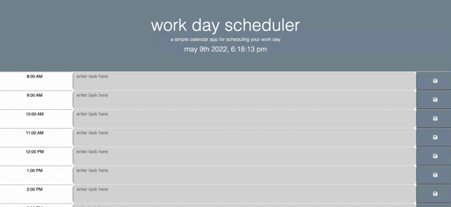

# Workday Scheduler
## Description

A simple calendar app to plan out your workday. This calendar has timeblocks that change color depending on the current hour. It also saves your entered tasks via local storage.

- My motivation with this project was to challenge myself to get more familiar with some 3rd party APIs I haven't used before. I was able to incorporate Bootstrap, FontAwesome, Google Fonts, and Moment.js, which were all pretty fun and interesting to work with. I definitely learned quite a bit with this project and now feel much more confident with local storage functionality as well!

## Usage

Use this application to plan your workday hour by hour! 

## Screenshot of Deployed Application

## Link to Deployed Application
https://maiavelli.github.io/workdayplanner/
